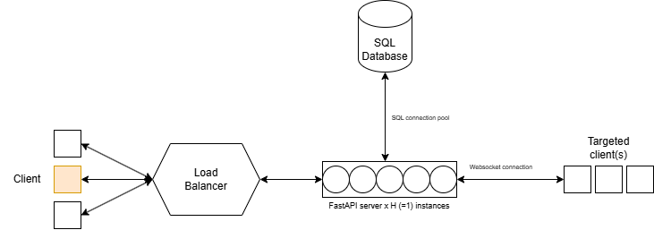

# Failure Analysis Report for Chat App

---

## 1. System Overview & Diagram

The chat application consists of:

- **Frontend:** React-based UI with WebSocket connection for real-time chat.
- **Backend:** FastAPI server handling WebSocket connections and REST APIs.
- **Database:** SQLAlchemy ORM with a relational DB for message persistence.
- **Infrastructure:** Single GCP e2-standard-2 instance (2 vCPUs, 8GB RAM).




---

## 2. Breaking Point Estimation

### Key Assumptions

- Server: GCP e2-standard-2 (2 vCPUs, 8GB RAM)
- Average message rate: 1 message per user per second
- Each connection is persistent WebSocket
- 1 operator + 1 manager per chat (2 users per chat)
- Average message payload size ~ 200 bytes JSON
- DB write + commit per message
- WebSocket broadcast to all connected clients except sender

---

### Performance Estimation & Bottlenecks

#### CPU and Message Handling

- **WebSocket broadcast loop** iterates over all connected clients on every message.
- Each message sent results in:

  - **1 DB write** (commit)  
  - **N-1 WebSocket sends** where N = number of connected clients  

- Assume:
  - 2 vCPUs @ ~2.5 GHz (total ~5 GHz CPU power)
  - CPU cycles per message:  
    - DB commit: ~1 ms CPU time  
    - WebSocket send: ~0.2 ms CPU time per client  
  - For 1 message, CPU time = 1 ms + 0.2 ms × (N - 1)

- With M concurrent users sending 1 msg/sec each:  
  Total messages/sec = M  
  Total CPU time per second = M × [1 ms + 0.2 ms × (M - 1)]

---

#### Estimating Max Concurrent Users

To find how many users the system can support before CPU becomes saturated, we start with earlier assumptions:

##### CPU Cost Per Message

Each user sends **1 message per second**, and each message incurs:

- **DB write** → ~1 ms CPU  
- **WebSocket sends to (N - 1) clients** → 0.2 ms per client

So, CPU time per message:

```
CPU_per_message = 1 ms + 0.2 × (N - 1) ms
```

Where `N` = number of concurrent users (each with a WebSocket connection).

---

##### Total CPU Budget

- The server has **2 vCPUs** → 2 × 1000 ms = 2000 ms CPU time/sec  
- Assuming **80% usable CPU** (to leave room for OS, FastAPI, etc):  
  ```
  Max usable CPU for message handling = 1600 ms/sec
  ```

---

##### Total CPU Usage Per Second

If all **N users** send **1 message per second**, total messages/sec = `N`

Total CPU usage per second:

```
Total_CPU = N × [1 + 0.2 × (N - 1)]
```

Simplify:

```
Total_CPU = N × (1 + 0.2N - 0.2) = N × (0.8 + 0.2N)
```

---

#### 🧩 Final Equation

To avoid CPU saturation:

```
N × (0.8 + 0.2N) ≤ 1600
```

Multiply through to clear decimals:

```
0.2N² + 0.8N ≤ 1600
→ N² + 4N ≤ 8000
```

Now solve the quadratic:

```
N² + 4N - 8000 ≤ 0

N = [-4 ± √(4² + 4×8000)] / 2
  = [-4 ± √(16 + 32000)] / 2
  = [-4 ± √32016] / 2
  ≈ [-4 + 179] / 2 = 87.5
```

---

#### ✅ Conclusion

**Maximum concurrent users ≈ 87**  
(Each sending 1 msg/sec, before CPU becomes a bottleneck)

---

### Memory

- WebSocket connection overhead ~200 KB per connection (buffers, stack, etc)  
- For 87 users: ~17.4 MB RAM, which is well within 8GB RAM limit.  
- DB and other processes consume the rest.

---

### Network

- Message size ~200 bytes  
- Total outgoing data/sec ≈ 200 bytes × (M users) × (M - 1) clients  
- For 87 users: ~200 × 87 × 86 = ~1.4 MB/sec outgoing traffic  
- Network bandwidth on GCP instance (~1 Gbps) is sufficient here.

---

## 3. Monitoring Plan & Implementation

### Metrics to Monitor

1. **CPU Usage (%)**  
   - High sustained CPU usage indicates overload.

2. **Active WebSocket Connections**  
   - Track connection count to observe scaling.

3. **Messages Per Second (incoming/outgoing)**  
   - To correlate load with CPU/network.

4. **Message Latency**  
   - Time from message receipt to broadcast completion.

5. **Error Rates**  
   - Connection drops, WebSocket send failures.

---

### Detection of Bottlenecks in Production

- Set alerts on CPU > 80% sustained  
- Alerts on sudden spike or drop in active connections  
- Monitor message latency — rising latency signals processing backlog

